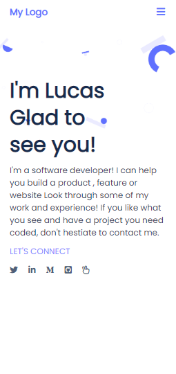

# Project: Portfolio Website

## In the fourth milestone the portfolio website, you will:

>Evaluate your website against accessibility best practices and implement any necessary changes to ensure that your website is accessible.

# Project Screenshot image
<table>
  <tr>
  
</tr>
  <tr>
<td>
    
</td>
    <td></td>
  </tr>

</table>

## Link to the live page

> [Check out the Portfolio Website](https://lucash2022.github.io/LucasPortfolio/).

## Getting Started

- Create a local directory that you want to clone the repository.

- Open the command prompt in the created directory.

- On the terminal run this command git clone https://github.com/Lucash2022/LucasErkanaPortfolio_Website.git

- Go to the repository folder using command prompt cd LucasErkanaPortfolio_Website.

- Install the dev dependencies for linters run npm install.

## Built with

- HTML, CSS & JAVASCRIPT 

## Authors

👤 **Lucas Erkana**

- GitHub: [@githubhandle](https://github.com/Lucash2022)
- Twitter: [@twitterhandle](https://twitter.com/@Lucas_David_22)
- LinkedIn: [LinkedIn](https://www.linkedin.com/in/lucas-erkana/)

## Collaborators
-Houda Mazari[@githubhandle](https://github.com/houdamzari)

-Kelvin Kaviku[@githubhandle](https://github.com/brainskev)

## 🤝 Contributing

Contributions, issues, and feature requests are welcome!
Feel free to check the [issues](https://github.com/Lucash2022/LucasErkanaPortfolio_Website/issues)

## Show your support

Give a ⭐️ if you like this project!

## Acknowledgments
-Houda Mazari[@githubhandle](https://github.com/houdamzari)
-Alex Ogeto[@alex_ogeto](https://github.com/Osoro254Alex)

## 📝 License

This project is [MIT](./LICENSE) licensed.

